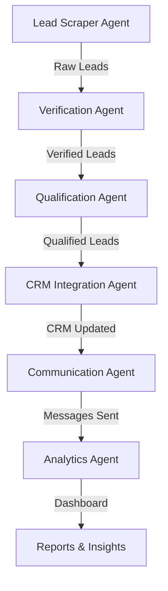

# Dubai Real Estate Lead Generation Workflow

An intelligent multi-agent system for automating lead generation in the Dubai real estate market using CrewAI.

## Overview

This workflow automates the entire lead generation process from scraping to analytics:

1. **Lead Scraping** - Extracts leads from LinkedIn, Property Finder, Bayut, and Dubizzle
2. **Verification** - Validates property information and contact details
3. **Qualification** - Scores and filters leads based on criteria
4. **CRM Integration** - Adds qualified leads to Google Sheets and Airtable
5. **Communication** - Sends personalized WhatsApp and email messages
6. **Analytics** - Generates comprehensive dashboards and reports

## Architecture



## Features

- 🤖 **6 Specialized AI Agents** working in coordination
- 🌐 **Multi-Source Scraping** from major Dubai real estate platforms
- ✅ **Automated Verification** via Dubai Land Department API
- 📊 **Intelligent Qualification** with scoring system (0-10)
- 💾 **Dual CRM Integration** (Google Sheets + Airtable)
- 📱 **Multi-Channel Communication** (WhatsApp, Email, n8n)
- 📈 **Real-Time Analytics** with beautiful HTML dashboards

## Installation

### Prerequisites

- Python 3.8+
- OpenAI API key
- Optional: API keys for external services (see `.env.example`)

### Setup

1. Clone the repository:
```bash
cd dubai_real_estate_workflow
```

2. Install dependencies:
```bash
pip install -r requirements.txt
```

3. Configure environment variables:
```bash
cp .env.example .env
# Edit .env with your API keys
```

4. Run the workflow:
```bash
python main.py
```

## Configuration

Edit `config.yaml` to customize:

- **Target areas** - Dubai neighborhoods to focus on
- **Lead qualification criteria** - Budget range, property types, bedrooms
- **Data sources** - Enable/disable specific platforms
- **Agent settings** - Customize agent roles and behaviors
- **Communication templates** - Personalize message templates
- **Dashboard metrics** - Choose which metrics to display

## Usage

### Run Full Workflow

```bash
python main.py
```

### Run in Test Mode (Mock Data)

```bash
python main.py --test
```

### Use Custom Config

```bash
python main.py --config custom_config.yaml
```

## Agents

### 1. Lead Scraper Agent
- **Role**: Extract leads from multiple sources
- **Tools**: LinkedIn, Property Finder, Bayut, Dubizzle scrapers
- **Output**: Raw lead data with contact information

### 2. Verification Agent
- **Role**: Validate property and contact information
- **Tools**: Dubai Land Department API, Contact Validator
- **Output**: Verified leads with validation status

### 3. Qualification Agent
- **Role**: Score and filter leads
- **Scoring**: 0-10 based on budget, area, property type, contact quality
- **Output**: Qualified leads (score ≥ 6)

### 4. CRM Integration Agent
- **Role**: Add leads to CRM systems
- **Tools**: Google Sheets, Airtable
- **Output**: CRM integration report

### 5. Communication Agent
- **Role**: Send personalized outreach
- **Tools**: Twilio WhatsApp, Email, n8n Webhook
- **Output**: Communication delivery report

### 6. Analytics Agent
- **Role**: Generate insights and dashboards
- **Tools**: Metrics Calculator, Dashboard Generator
- **Output**: HTML/JSON dashboards with KPIs

## Output

### Dashboards
Generated in `dashboards/` directory:
- `dashboard_YYYYMMDD_HHMMSS.html` - Interactive HTML dashboard
- `dashboard_YYYYMMDD_HHMMSS.json` - JSON data export

### Logs
Detailed execution logs in `logs/workflow.log`

### Metrics
- Total leads found
- Qualification rate
- Conversion rate
- Response rate
- Top areas in demand
- Average budget
- Quality scores

## Environment Variables

Required:
- `OPENAI_API_KEY` - Your OpenAI API key

Optional (uses mock data if not set):
- `DUBAI_LAND_DEPT_API_KEY` - Dubai Land Department API
- `GOOGLE_SHEETS_CREDENTIALS_FILE` - Google Sheets credentials
- `GOOGLE_SHEETS_SPREADSHEET_ID` - Target spreadsheet
- `AIRTABLE_API_KEY` - Airtable API key
- `AIRTABLE_BASE_ID` - Airtable base ID
- `TWILIO_ACCOUNT_SID` - Twilio account SID
- `TWILIO_AUTH_TOKEN` - Twilio auth token
- `TWILIO_WHATSAPP_NUMBER` - Twilio WhatsApp number
- `SMTP_HOST` - Email SMTP host
- `SMTP_USERNAME` - Email username
- `SMTP_PASSWORD` - Email password
- `N8N_WEBHOOK_URL` - n8n webhook URL

See `.env.example` for complete list.

## Customization

### Add New Data Source

1. Create a new scraper tool in `tools/scraping_tools.py`
2. Add the tool to the Lead Scraper Agent in `agents.py`
3. Update the scraping task in `tasks.py`

### Modify Qualification Criteria

Edit `config.yaml`:
```yaml
lead_qualification:
  min_budget_aed: 600000
  max_budget_aed: 50000000
  property_types:
    - "apartment"
    - "villa"
  bedroom_range:
    min: 1
    max: 3
```

### Customize Communication Templates

Edit templates in `config.yaml` under `communication` section.

## Troubleshooting

### Common Issues

1. **Missing OpenAI API Key**
   ```
   Error: OPENAI_API_KEY not found
   Solution: Set OPENAI_API_KEY in .env file
   ```

2. **Import Errors**
   ```
   Error: No module named 'crewai'
   Solution: pip install -r requirements.txt
   ```

3. **Rate Limiting**
   ```
   Error: Rate limit exceeded
   Solution: Adjust rate_limiting settings in config.yaml
   ```

## Best Practices

1. **Start with Test Mode** - Run `python main.py --test` first
2. **Monitor Logs** - Check `logs/workflow.log` for issues
3. **Respect Rate Limits** - Configure delays in `config.yaml`
4. **Verify Data Quality** - Review dashboards regularly
5. **Update Templates** - Personalize communication templates

## License

MIT License - See LICENSE file for details

## Support

For issues and questions:
1. Check the logs in `logs/workflow.log`
2. Review the configuration in `config.yaml`
3. Refer to the main repository README
4. Open an issue on GitHub

## Contributing

Contributions welcome! Please:
1. Fork the repository
2. Create a feature branch
3. Submit a pull request

---

**Note**: This workflow uses mock data for demonstration when API keys are not configured. For production use, configure all required API keys in the `.env` file.
